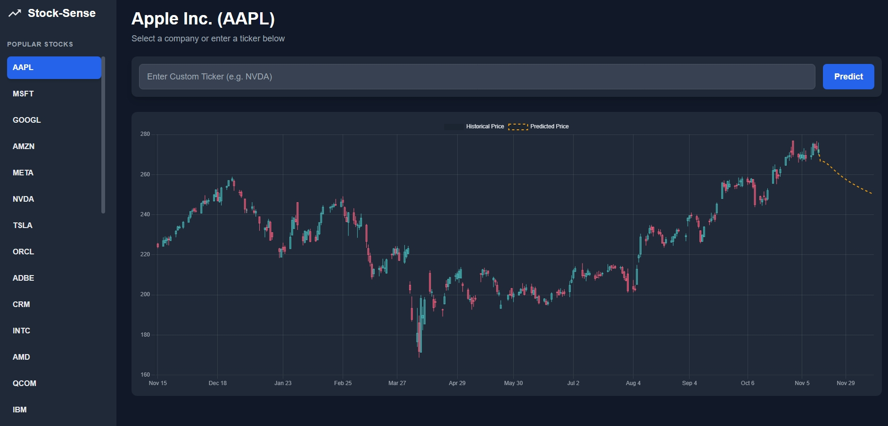

# 📈 Stock Market Prediction (Flask + LSTM)

A simple end-to-end app that **predicts the next 30 closing prices** for a stock using an **LSTM** model.  
Backend is built with **Flask**, data is fetched via **yfinance**, and the model is saved/loaded as `stock_predictor_model.h5`.  
Frontend (`index.html`, `script.js`, `style.css`) calls the API and can visualize results.

---

## 🚀 Features

- 🔄 `/predict` API: 1-year OHLC download + 30-day price forecast  
- 🧠 LSTM model (Keras) with MinMax scaling  
- 💾 Training script (`train_model.py`) to regenerate `stock_predictor_model.h5`  
- 🌐 CORS enabled for easy frontend integration  
- 🧭 Works with any Yahoo Finance ticker (e.g., `AAPL`, `GOOGL`, `TSLA`)

---

## 🧠 How It Works (High Level)

1. **Training (`train_model.py`)**
   - Downloads historical `Close` prices (default: `GOOGL`, 2015–2025).
   - Scales data to `[0,1]`, creates sliding windows of `TIME_STEP=100`.
   - Trains a 3-layer LSTM with Dropout; saves model as `stock_predictor_model.h5`.

2. **Serving (`app.py`)**
   - Loads the model and a `MinMaxScaler`.
   - On `POST /predict` with `{ "ticker": "AAPL" }`:
     - Downloads 1-year of data for the ticker.
     - Builds the last 100-day sequence and predicts 30 steps ahead.
     - Returns company name, OHLC data, and predicted prices.

---

## 🧰 Tech Stack

- **Python**, **Flask**, **Keras** (TensorFlow backend), **NumPy**, **scikit-learn**
- **yfinance** for market data
- (Optional) **HTML/CSS/JS** frontend in this repo

---

## 📂 Project Structure

    project/
    │
    ├── app.py # Flask API server (/predict)
    ├── train_model.py # LSTM training script (saves stock_predictor_model.h5)
    ├── stock_predictor_model.h5 # Saved Keras model (generated by train_model.py)
    │
    ├── index.html # Simple demo UI
    ├── script.js # Calls the Flask API
    ├── style.css # Styles for demo UI
    │
    ├── requirements.txt # Python dependencies
    ├── package-lock.json # (If you use node for tooling; optional)
    └── README.md

  ## 📦 Setup
  
      > Requires Python 3.9+.
      
      
      # 1) Clone
      git clone https://github.com/your-username/stock-prediction.git
      cd stock-prediction
      
      # 2) Create & activate a virtual env (recommended)
      python -m venv .venv
      # Windows
      .venv\Scripts\activate
      # macOS/Linux
      source .venv/bin/activate
      
      # 3) Install deps
      pip install -r requirements.txt
      (Optional) Retrain the Model
      bash
      Copy code
      python train_model.py
      This regenerates stock_predictor_model.h5 using the config at the top of the script (ticker, dates, time step, epochs, etc.).
  
  ▶️ Run the API
  
    Copy code
    python app.py
    The server starts at http://localhost:5000.
    
    🔌 API
    POST /predict
    Body
    
    json
    Copy code
    { "ticker": "GOOGL" }
    Response
    
    json
    Copy code
    {
      "ticker": "GOOGL",
      "company_name": "Alphabet Inc.",
      "ohlc_data": [
        { "Date": "2024-01-02", "Open": 135.0, "High": 137.2, "Low": 134.7, "Close": 136.9, "Volume": 12345678 },
        ...
      ],
      "predicted_prices": [ 140.12, 140.47, ... ]   // 30 values
    }
    cURL example
    
    
    Copy code
    curl -X POST http://localhost:5000/predict \
      -H "Content-Type: application/json" \
      -d '{"ticker": "AAPL"}'
      
  🌐 Frontend Demo
  
    Open index.html in a browser (or serve it with any static server).
    script.js posts the selected ticker to http://localhost:5000/predict and can plot results.
    
    If you’re serving the backend on another host/port, update the URL in script.js.
    
    ⚙️ Notes & Tips
    The server loads a sample GOOGL series to fit the scaler at startup and re-fits on the live ticker before inference (keeps scale consistent for that series).
    
    TIME_STEP = 100 and days_to_predict = 30 are set in app.py. Adjust as needed.
    
    If you change the training dates/ticker/hyperparameters, retrain and ship the new stock_predictor_model.h5.
    
  🚢 Deployment
  
  Render/Heroku/Fly.io: run python app.py (expose port 5000).
  
  Make sure stock_predictor_model.h5 is included in the deployment, or retrain on the server.
  
  <h2 align="center">📈 Model Output Comparison</h2>

  
  &nbsp;&nbsp;
  

⚠️ Disclaimer

This project is for educational purposes only and not financial advice.

Forecasts are experimental and should not be used for trading decisions.

👤 Author

Dhyan BK

🔗 Portfolio: https://dhyanbk-porfolio.netlify.app/

🐙 GitHub: https://github.com/dhyanbk
